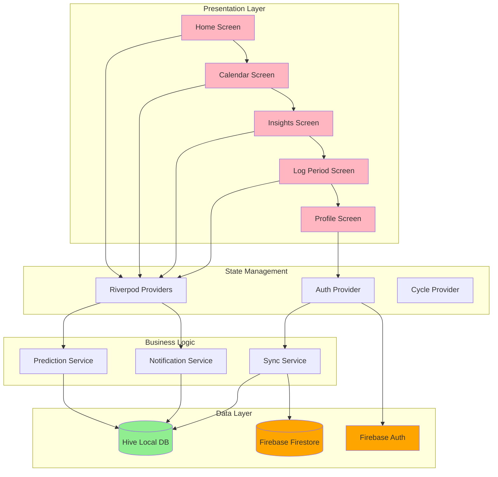
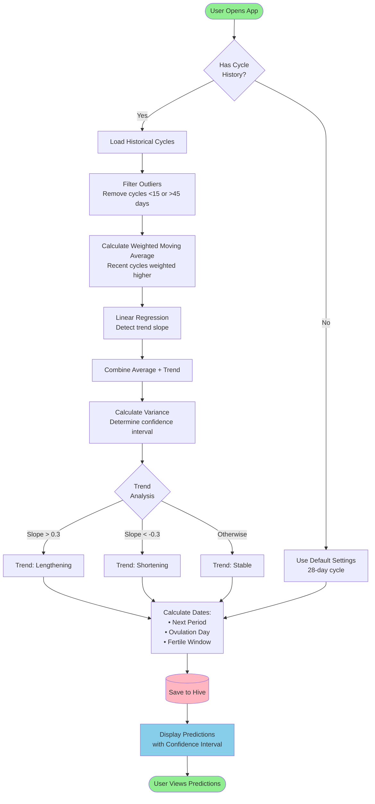
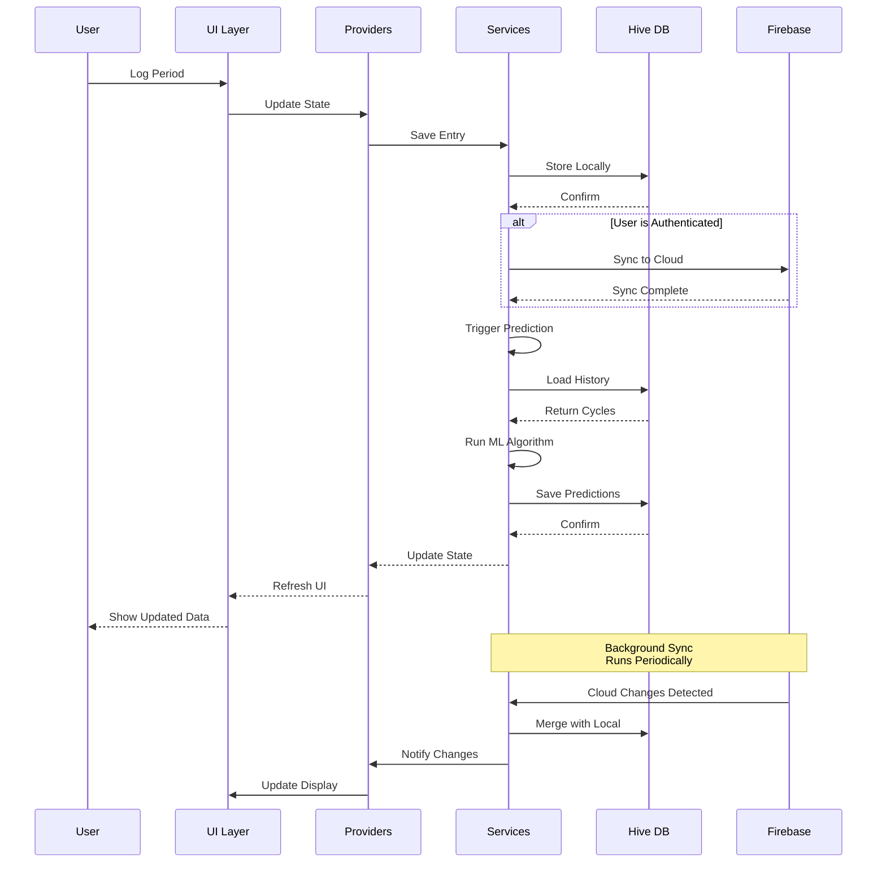

# 🌸 PeriodsTracker

A comprehensive, privacy-focused menstruation tracking application built with Flutter. Track your cycle, predict future periods with ML-powered algorithms, and gain insights into your reproductive health—all with offline-first architecture and optional cloud sync.

[](https://flutter.dev)
[](https://firebase.google.com)
[](LICENSE)

## ✨ Features

### 📊 Smart Predictions
- **ML-Powered Algorithm**: Uses weighted moving average and linear regression to predict next period
- **Trend Detection**: Identifies if your cycle is stable, lengthening, or shortening
- **Confidence Intervals**: Provides accuracy estimates (±1-5 days) based on cycle regularity
- **Outlier Filtering**: Automatically filters out anomalies for more accurate predictions

### 📅 Comprehensive Tracking
- **Period Logging**: Track start/end dates, flow levels, symptoms, and mood
- **Calendar View**: Visual representation of your cycle with color-coded indicators
- **Symptom Tracking**: Monitor cramps, headaches, bloating, and more
- **Mood Tracking**: Log emotional states throughout your cycle

### 📈 Insights & Analytics
- **Cycle Statistics**: Average cycle length, period duration, and variability
- **Visual Charts**: Interactive graphs showing cycle trends over time
- **Fertile Window**: Automatic calculation of ovulation and fertile days
- **Historical Data**: View and analyze past cycles

### 🔒 Privacy & Data
- **Offline-First**: All data stored locally using Hive database
- **Optional Cloud Sync**: Backup to Firebase Firestore (requires authentication)
- **Automatic Conflict Resolution**: Smart merging of local and cloud data
- **No Ads**: Your health data is never sold or shared

### 🔔 Notifications
- **Period Reminders**: Get notified before your next period
- **Customizable Alerts**: Set reminder timing based on your preferences
- **Local Notifications**: Works even without internet connection

## 🏗️ Architecture



## 🔄 Prediction Algorithm Workflow



## 📱 Data Flow



## 🛠️ Tech Stack

| Category | Technology |
|----------|-----------|
| **Framework** | Flutter 3.9.2 |
| **Language** | Dart |
| **State Management** | Riverpod 2.6.1 |
| **Local Database** | Hive 2.2.3 |
| **Cloud Backend** | Firebase (Firestore, Auth, Analytics, Crashlytics) |
| **Charts** | FL Chart 0.69.0 |
| **Calendar** | Table Calendar 3.1.2 |
| **Notifications** | Flutter Local Notifications 18.0.1 |
| **Animations** | Lottie 3.3.0 |

## 📦 Installation

### Prerequisites
- Flutter SDK 3.9.2 or higher
- Dart SDK
- Android Studio / Xcode (for mobile development)
- Firebase account (optional, for cloud sync)

### Setup

1. **Clone the repository**
   ```bash
   git clone https://github.com/yourusername/mensuration_tracker.git
   cd mensuration_tracker
   ```

2. **Install dependencies**
   ```bash
   flutter pub get
   ```

3. **Generate Hive adapters**
   ```bash
   flutter pub run build_runner build --delete-conflicting-outputs
   ```

4. **Firebase Setup (Optional)**
   
   For cloud sync features:
   - Create a Firebase project at [Firebase Console](https://console.firebase.google.com)
   - Add Android/iOS apps to your Firebase project
   - Download `google-services.json` (Android) and `GoogleService-Info.plist` (iOS)
   - Place them in the appropriate directories:
     - Android: `android/app/google-services.json`
     - iOS: `ios/Runner/GoogleService-Info.plist`
   
   > **Note**: The app works fully offline without Firebase. Cloud sync is optional.

5. **Run the app**
   ```bash
   flutter run
   ```

## 🚀 Usage

### First Time Setup
1. Launch the app
2. Create an account (optional) or skip to use offline mode
3. Enter your last period start date
4. Set your average cycle length
5. Start tracking!

### Logging a Period
1. Navigate to the **Log** tab
2. Select the start date
3. Add symptoms and mood (optional)
4. Set flow level
5. Mark end date when period ends

### Viewing Predictions
- **Home Screen**: See your next predicted period and fertile window
- **Calendar Screen**: Visual representation of past and predicted cycles
- **Insights Screen**: Detailed analytics and trends

### Syncing Data
- Sign in with email/password
- Data automatically syncs in the background
- Works offline and syncs when connection is restored

## 📊 Prediction Algorithm Details

The app uses an enhanced prediction algorithm that combines multiple statistical methods:

### 1. **Weighted Moving Average**
Recent cycles are given more weight using exponential decay:
```
weight(i) = 0.8^i
```

### 2. **Linear Regression**
Detects trends in cycle length over time:
```
slope = (n·Σxy - Σx·Σy) / (n·Σx² - (Σx)²)
```

### 3. **Variance Analysis**
Calculates confidence intervals based on cycle regularity:
```
confidence = 1.5 × σ  (87% confidence interval)
```

### 4. **Outlier Filtering**
Removes anomalies:
- Cycles < 15 days (spotting)
- Cycles > 45 days (missed periods)

## 🗂️ Project Structure

```
lib/
├── components/          # Reusable UI components
├── models/             # Data models (Hive entities)
│   ├── cycle_entry.dart
│   ├── predictions.dart
│   └── user_settings.dart
├── providers/          # Riverpod state providers
│   ├── auth_provider.dart
│   └── cycle_provider.dart
├── screens/            # App screens
│   ├── home_screen.dart
│   ├── calendar_screen.dart
│   ├── insights_screen.dart
│   ├── log_period_screen.dart
│   └── profile_screen.dart
├── services/           # Business logic
│   ├── hive_service.dart
│   ├── prediction_service.dart
│   ├── notification_service.dart
│   └── sync_service.dart
├── utils/              # Helper functions
└── main.dart           # App entry point
```

## 🔐 Privacy & Security

- **Local-First**: All data stored on device by default
- **Encrypted Storage**: Hive database with encryption support
- **No Tracking**: No analytics without explicit consent
- **Open Source**: Transparent codebase for security audits
- **GDPR Compliant**: Full control over your data

## 🤝 Contributing

Contributions are welcome! Please follow these steps:

1. Fork the repository
2. Create a feature branch (`git checkout -b feature/AmazingFeature`)
3. Commit your changes (`git commit -m 'Add some AmazingFeature'`)
4. Push to the branch (`git push origin feature/AmazingFeature`)
5. Open a Pull Request

## 📝 License

This project is licensed under the MIT License - see the [LICENSE](LICENSE) file for details.

## 🙏 Acknowledgments

- Flutter team for the amazing framework
- Firebase for backend infrastructure
- Open source community for various packages used

## 📧 Contact

For questions or support, please open an issue on GitHub.

---

**Made with ❤️ for women's health**
